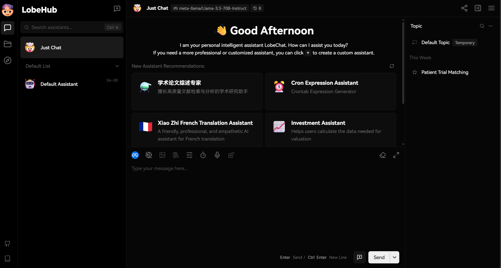

# Patient–Trial Matching Notebooks

This repository contains Jupyter notebooks for simulating clinical trials and matching synthetic patients to trials using both **TF-IDF** and [**Bio_ClinicalBERT**](https://huggingface.co/emilyalsentzer/Bio_ClinicalBERT) embeddings. All work is organized under the `notebooks/` folder.

This project was powered by **LobeChat** using a **custom OpenAI-compatible API key** connected to a **Meta-Llama-3.3-7B-Instruct** model.  
> The model is hosted on **Denvr Dataworks**, leveraging **Intel's Gaudi 2 accelerator** for efficient inference.



To learn more about enterprise-scale inference, available models, and how to deploy your own AI workloads with Gaudi, visit [denvrdata.com/intel](https://www.denvrdata.com/intel)


## Repo structure

```
llm-drug-discovery/
├── data/
├── notebooks/
├── plots/
├── requirements.txt
└── README.md
```


#### `data/`: 
  - Raw CSV from UCI (heart_failure_clinical_records_dataset.csv)
  - Generated JSON files (`train_patients.json`, `train_trials.json`, etc.)
  - Evaluation results (`matching_eval.csv`).

#### `notebooks/`:
  1. [**`00_explore_dataset.ipynb`**](./notebooks/00_explore_dataset.ipynb) – load and explore the original heart failure dataset.  
  2. [**`01_simulate_trials.ipynb`**](./notebooks/01_simulate_trials.ipynb) – generate synthetic clinical trial protocols and match patients to those trials using deterministic rules.  
  3. [**`02_patient_trial_matching.ipynb`**](./notebooks/02_patient_trial_matching.ipynb) – baseline TF-IDF text‐similarity approach to match patients and trials, with threshold tuning and per‐trial F1 evaluation.  
  4. [**`03_enhanced_patient_trial_matching.ipynb`**](./notebooks/03_enhanced_patient_trial_matching.ipynb) – enhanced matching using Bio_ClinicalBERT embeddings combined with a rule‐based prefilter; threshold tuning and per‐trial F1 evaluation.

#### `plots/`:
  - Pre‐generated figures (F1 vs. threshold, precision/recall) used in the notebooks.

#### `requirements.txt`: 
  - List of Python packages required to run all notebooks.


## Getting Started

### 1. Clone the Repository

```bash
git clone https://github.com/murilogustineli/llm-drug-discovery.git
cd llm-drug-discovery
```

### 2. Set Up a Virtual Environment

It’s recommended to create and activate a Python 3.8+ virtual environment:

```bash
python -m venv .venv
source .venv/bin/activate      # on macOS/Linux
# .venv\Scripts\activate       # on Windows
```

### 3. Install Dependencies

```bash
pip install -r requirements.txt
```


## Customization Options

- Modify the number of trials or patient samples in [`01_simulate_trials.ipynb`](./notebooks/01_simulate_trials.ipynb).

- Tune similarity threshold in:
   - [`02_patient_trial_matching.ipynb`](./notebooks/02_patient_trial_matching.ipynb) for TF-IDF
   - [`03_enhanced_patient_trial_matching.ipynb`](./notebooks/03_enhanced_patient_trial_matching.ipynb) for TF-IDF

- You're encouraged to add new notebooks or scripts to explore other models or similarity methods!


## Paper & Context

This work was inspired by methods in clinical trial matching presented in the paper [***"Large Language Models in Drug Discovery and Development: From Disease Mechanisms to Clinical Trials"***](https://arxiv.org/abs/2409.04481), focusing only on the “Clinical Trials” stage. The original heart failure dataset comes from [**UCI: Heart Failure Clinical Records Data Set**](https://archive.ics.uci.edu/dataset/519/heart+failure+clinical+records).


## Video Walkthrough (Coming Soon)
> *A walkthrough video will be added here once published.*
